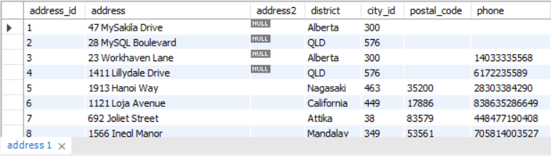

# Exercícios de fixação
Então, depois de ter visto o conteúdo acima, vamos tentar chegar a algumas conclusões utilizando como exemplo a tabela a seguir:

Sem ter acesso à estrutura interna de como essa tabela foi criada, tente responder ao seguinte:

Quais constraints a coluna address_id poderia ter? Por quê?

A coluna city_id é um número. Consegue identificar que tipo de constraint foi aplicado a ela?

A coluna address (endereço) possui uma constraint . Qual tipo de constraint seria interessante ser aplicado a ela para que sempre exista um valor na coluna quando uma nova linha for criada?x  
